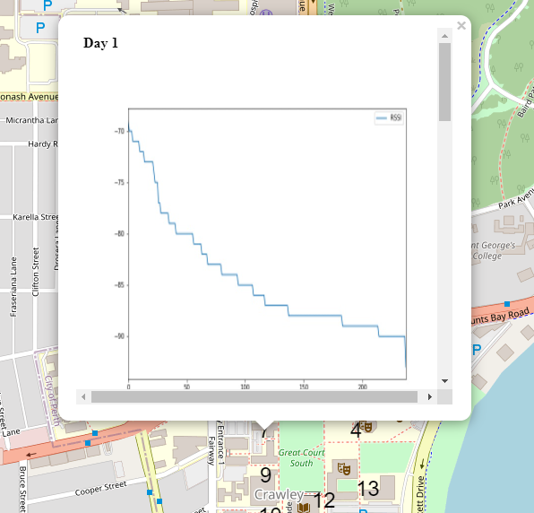

# CITS4419 project - Measuring Wi-Fi Signals to Analyse RSSI
### Roarke Holland 21742366 | Thi Phuong Thao Le 22755019
#### Map
The folder CITS4419_project includes a html file "mapping.html" which displays the measured locations of the data at the areas on the UWA campus. Upon clicking on the numbers around the campus, an iframe pops up and allows the user to observe the RSSI measurements and channel statistics in a plot.
#### Notebook
The notebook aims to provide analysis of the measured data taken on the UWA campus. The data is firstly read into a dataframe format then analysed with plots being created which display RSSI drop off over the entire course of measuring a location. Upon creating the plots they are saved as jpg files in the root directory under "imgs". An additional plot is made with the unique channels found during the measuring process and the number of SSIDs on the given channels. These plots are then saved as mentioned previously. The created plots are then appended in an iframe format onto a map of the UWA campus where the user can inspect the measurements at given locations. Analysis of the RSSI information is then discussed at the end of the notebook where recommendations are given to the various locations and a table of the summaries RSSI data is shown.

### Example of RSSI plotted on UWA map
### 

#### Converting .txt to .csv python script
For the purpose of this experiment it is only necessary to use the python jupyter notebook provided.
However, the convert_csv.py file demonstrates how the raw data is taken from .txt format into a .csv file which can be used in the notebook.

If the experiment is repeated then the following steps need to be follow:
- measure data with the application discussed
- copy the measured data into a .txt file
- change the folders "data_2_9", "data_9_9" to the required names
- run the convert_csv.py file
- edit the same folders names as presented in the notebook labelled "index_csv_1", "index_csv_2"